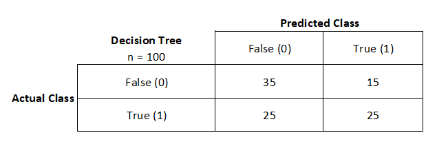

# Confused About The Confusion Matrix?
I will be talking about how the confusion matrix works and its practical uses to benchmark which algorithms work best for the model you are trying to build.

## Notes
 - In these series of examples, I will go by scikit-learn's confusion matrix layout. Please check your confusion table first before proceeding further.
 - All these examples are hypothetical and are not based on real data for simplicities' sake.

## What is the Confusion Matrix?
>In the field of machine learning and specifically the problem of statistical classification, a confusion matrix, also known as an error matrix, is a specific table layout that allows visualization of the performance of an algorithm, typically a supervised learning one (in unsupervised learning it is usually called a matching matrix). Each row of the matrix represents the instances in a predicted class while each column represents the instances in an actual class (or vice versa). The name stems from the fact that it makes it easy to see if the system is confusing two classes (i.e. commonly mislabeling one as another).
>
>It is a special kind of contingency table, with two dimensions ("actual" and "predicted"), and identical sets of "classes" in both dimensions (each combination of dimension and class is a variable in the contingency table).
>
> -[wikipedia](https://en.wikipedia.org/wiki/Confusion_matrix)

## Table Layout
If working with a binary classification scikit-learn's confusion matrix will be broken down as the [following](https://scikit-learn.org/stable/modules/generated/sklearn.metrics.confusion_matrix.html): 

## Example: Classification models have been trained to predict whether a person likes a dog (True) or not (False) based on different variables.
We want to benchmark our hypothetical binary classification models. So we try [Naive Bayes](https://en.wikipedia.org/wiki/Naive_Bayes_classifier), [Logistic Regression](https://en.wikipedia.org/wiki/Logistic_regression), and [Decision Tree](https://en.wikipedia.org/wiki/Decision_tree_learning); some classic machine learning algorithms.

### How do I choose the best model?
Based on this hypothetical example I see that our best performing model was Naive Bayes because out of 50 False and True actual classes it was able to correctly identify 45 (90%).

### What if my confusion matrix does not look like Naive Bayes and it looks more like the Logistic Regression and Decision Tree?
If this is the case for you, you'll need to decide which you care about more [recall or precision](https://en.wikipedia.org/wiki/Precision_and_recall). More on this on the next blog post.